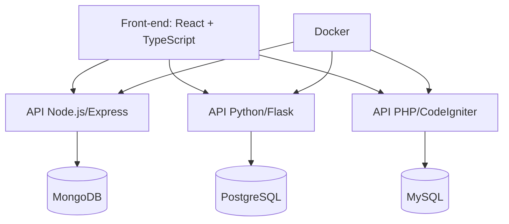

### **📌 Nome do Projeto: "TaskFlow"**  
*(Um sistema de gerenciamento de tarefas com microsserviços e múltiplas stacks)*  

#### **🎯 Objetivo**  
Criar uma aplicação que integre todas as suas habilidades:  
- **Front-end moderno** (React + TypeScript)  
- **Back-end poliglota** (PHP legado + Python/Node.js para APIs novas)  
- **DevOps** (Docker, CI/CD)  
- **Banco de dados** (MySQL + MongoDB)  
- **Metodologias ágeis** (SCRUM via GitHub Projects)  

---

### **🔧 Arquitetura do Projeto**  


---

### **🚀 Funcionalidades por Tecnologia**  

#### **1. Front-end (React + TypeScript)**  
- Interface responsiva com drag-and-drop (ex: Kanban de tarefas)  
- Consumo de **3 APIs diferentes** (Node.js, Python, PHP)  
- Autenticação JWT  

#### **2. Back-end (Node.js + Express)**  
- API REST para CRUD de usuários  
- Rota de autenticação (JWT)  
- Integração com MongoDB  

#### **3. Back-end (Python + Flask)**  
- API para processamento assíncrono (ex: gerar relatórios em PDF)  
- RPA simples (ex: web scraping integrado)  

#### **4. Back-end (PHP + CodeIgniter)**  
- Módulo legado simulando migração (ex: histórico de tarefas antigas)  
- Conexão com MySQL  

#### **5. DevOps (Docker + GitHub Actions)**  
- Containerização de cada serviço (`docker-compose.yml`)  
- CI/CD básico (testes automatizados no GitHub Actions)  

#### **6. Banco de Dados**  
- **MySQL**: Dados estruturados (tarefas legadas)  
- **MongoDB**: Dados flexíveis (logs, configurações)  
- **PostgreSQL**: Dados analíticos (estatísticas)  

---

### **📂 Estrutura do Repositório**  
```bash
TaskFlow/
├── frontend/           # React + TypeScript
├── api-node/           # Node.js + Express + MongoDB
├── api-python/         # Python + Flask + PostgreSQL
├── api-php/            # PHP + CodeIgniter + MySQL
├── docker-compose.yml  # Orquestração
└── README.md           # Docs com prints e explicações
```

---

### **✨ Diferenciais do Projeto**  
- **Demonstra versatilidade**: Mostra que você domina múltiplas stacks.  
- **Cenário realista**: Simula integração com sistemas legados (PHP) + modernos.  
- **Pronto para entrevistas**: Pode ser usado para explicar decisões técnicas.  

---

### **🛠 Passo a Passo Simplificado**  
1. **Inicie pelo front-end** (React): Crie a interface do Kanban.  
2. **Desenvolva a API Node.js**: Faça a autenticação e CRUD básico.  
3. **Adicione a API Python**: Implemente um serviço assíncrono.  
4. **Integre o PHP**: Crie um módulo simples (ex: importar tarefas antigas).  
5. **Containerize tudo**: Use Docker para subir todos os serviços.  
6. **Documente**: Explique no README como cada tecnologia foi usada.  

---

### **🌐 Exemplos de Telas**  
- **Dashboard**: Gráficos (Chart.js) + lista de tarefas.  
- **Módulo Legado**: Tela simulando PHP + MySQL (ex: lista "antiga").  
- **Relatórios**: Página gerada pela API Python.  

---

### **🔗 Extras (Opcionais)**  
- **Deploy no Render/Vercel**: Front-end e APIs públicas.  
- **Vídeo no LinkedIn**: Demonstração do projeto funcionando.  

---

**Por que esse projeto?**  
- **Cobre 100% do seu currículo técnico**.  
- **Mostra capacidade de integrar sistemas heterogêneos** (diferencial para vagas que exigem trabalhar com legados).  
- **Pode ser evoluído** (ex: adicionar Kubernetes, AWS no futuro).  

Quer ajuda para estruturar alguma parte específica? Posso te enviar snippets de código ou links para templates! 😊  

**#PortfólioMatador #FullStack**
